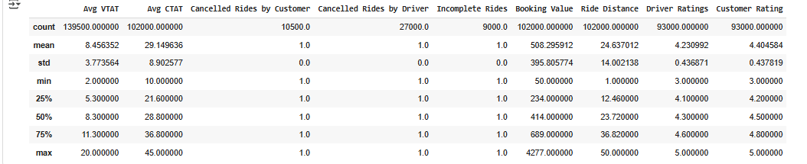
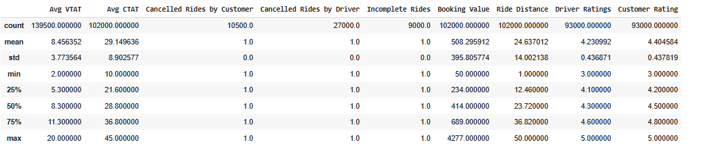
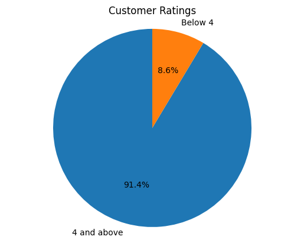

# Uber-Sales-Analytics
This comprehensive analysis contains detailed ride-sharing data from Uber operations for the year 2024, providing rich insights into booking patterns, vehicle performance, revenue streams, 
cancellation behaviors, and customer satisfaction metrics.

The goal of this analysis is to uncover insights in the data and make valuable recommendations for the company.

### Objectives of the Analysis
1. Data Importation
2. Data Exploration
3. Data Cleaning
4. Booking Patterns
5. Customer Ratings
6. Distribution of vehicle Types.

## Data and Library Importation
```python
# importing the necessary libraries
import pandas as pd
import numpy as np
import matplotlib.pyplot as plt
import seaborn as sns
import warnings
warnings.filterwarnings('Ignore')
```

```
df = pd.read_csv("/content/drive/MyDrive/Colab Notebooks/Uber Analytics/ncr_ride_bookings.csv")
```

## Data Exploration
## Data Snapshot

Before the commencement of the analysis, the data was examined which included checking the shape of the data, the data types, missing values. The results of the exploration revealed
that the dataset has 150,000 rows. Certain data fields like `Avg VTAT` (10500), `Avg CTAT` (48000), `Cancelled Rides by Customer` (139500), `Reason for cancelling by Customer` (139500),
`Cancelled Rides by Driver` (123000), `Driver Cancellation Reason` (123000), `Incomplete Rides` (141000), `Incomplete Rides Reason` (141000), `Booking Value` (48000), `Ride Distance` (48000),
`Driver Ratings` (57000), `Customer Rating` (57000), `Payment Method` (48000)

## Check for Outliers


## Summary Statistics



## Data Reprocessing
The data had to be adequately prepared before moving ahead with our analysis. Therefore, I 
* Removed data fields with too many missing values outrigthly
  
 # Dropping off data field with so much missing values
```python
df.drop(['Cancelled Rides by Customer', 'Reason for cancelling by Customer', 'Cancelled Rides by Driver', 'Driver Cancellation Reason', 'Incomplete Rides', 'Incomplete Rides Reason'], axis=1, inplace=True)
  ```

* Replaced missing values in other fields with median

```python
# replacing the missing vtat with the median
df['Avg VTAT'].fillna(df['Avg VTAT'].median(), inplace=True)
# replacing the missing avg CTAT with the median
df['Avg CTAT'].fillna(df['Avg CTAT'].median(), inplace=True)
# replacing the missing total booking value with the median
df['Booking Value'] = df['Booking Value'].fillna(df['Booking Value'].median())
# replacing the missing ride distance with the median
df['Ride Distance'] = df['Ride Distance'].fillna(df['Ride Distance'].median())
# replacing the missing driver rating with the median
df['Driver Ratings'] = df['Driver Ratings'].fillna(df['Driver Ratings'].median())
# replacing the missing customer rating with median
df['Customer Rating'] = df['Customer Rating'].fillna(df['Customer Rating'].median())
```

* Replacing the missing payment with the mode
  ```python
# replacing the missing payment method with the mode
```python
df['Payment Method'] = df['Payment Method'].fillna(df['Payment Method'].mode()[0])
  ```

### Converting the Date Field into a Proper Data Type

```python
# converting the date column to a proper date data
df['Date'] = pd.to_datetime(df['Date'])
# extract month from date
df['Month'] = df['Date'].dt.month
# extracting year from date
df['Year'] = df['Date'].dt.year*
```*

## Business Insights

1. What is the pattern of the customer's bookings?


# Calculate the number of customers with ratings 4 and above
customer_ratings_4_and_above = df[df['Customer Rating'] >= 4]['Customer Rating'].count()

# Calculate the total number of non-null customer ratings
total_customer_ratings = df['Customer Rating'].count()

# Calculate the percentage
percentage_4_and_above = (customer_ratings_4_and_above / total_customer_ratings) * 100

print(f"Percentage of customers who rated 4 and above: {percentage_4_and_above:.2f}%")

# Calculate the number of customers with ratings below 4
customer_ratings_below_4 = df[df['Customer Rating'] < 4]['Customer Rating'].count()
# Calculate the percentage
percentage_below_4 = (customer_ratings_below_4 / total_customer_ratings) * 100

print(f"Percentage of customers who rated below 4: {percentage_below_4:.2f}%")
```



